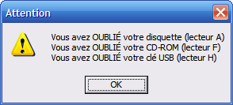

# oubli-support
Outil de détection des supports de stockage oubliés.

## Présentation
`oubli-support` est un script qui a été développé pour détecter les médias de stockage (disquettes, CD-ROM, clé USB, etc.) oubliés par les étudiant-e-s dans les laboratoires informatiques.
Lors de la fermeture de la session de travail, le script s'exécutait pour vérifier si des médias se trouvaient encore dans les lecteurs. Si le script détectait des supports non retirés, des bips audio étaient émis et un popup d'alerte apparaissait à l'écran.

## Archive du projet
Ce script s'avérait particulièrement pratique à une époque où le stockage physique était la norme. 
Cependant, avec l'évolution de la technologie et le passage à des solutions de stockage cloud, l'utilisation de médias de stockage physiques a considérablement diminué. Par conséquent, ce script n'est plus activement développé ou mis à jour.

Ce dépôt est maintenu en ligne comme une archive du projet.
 Il offre un aperçu de la manière dont les problèmes de stockage étaient gérés à une époque où le stockage *cloud* n'était pas encore la norme. N'hésitez pas à explorer le code et à l'utiliser comme point de départ pour vos propres projets ou simplement à des fins d'apprentissage.

## Défis techniques
Ce projet a présenté plusieurs défis techniques intéressants. Voici quelques-uns d'entre eux :

### Détection des supports USB éjectés
Ce défi, qui n'a malheureusement pas été résolu, apparait lorsque l'utilisateur déconnecte son support de stockage via l'icône idoine dans la zone système de la barre des tâches : puisque l'éjection logicielle d'un support USB le déconnecte du système d'exploitation, le script ne peut le détecter même s'il était encore physiquement branché au port.

### Gestion de la sortie audio
Un autre défi technique concernait le "bip" d'avertissement émis par le script en cas d'oubli d'un support de stockage. 
À l'origine, ce bip était produit par les *buzzers* soudés sur la carte-mère, qu'il était aisé de piloter avec la commande `beep`. 
Cependant, avec le temps, ces *buzzers* sont devenus de plus en plus rares, obligeant le script à émettre le son via l'écran ou une autre sortie audio.

De plus, dans des laboratoires ou autres environnements publics ou d'enseignement, pour assurer une certaine quiétude (à une époque où YouTube apparaissait et la consultation de vidéos explosait), le volume des postes était généralement en sourdine. 
Par conséquent, le script devait réactiver la sortie audio, ajuster le volume juste assez pour que le bip soit audible, puis remettre à nouveau la sortie audio en sourdine.

### Gestion du pilote de la couche audio
Un dernier défi concernait la gestion du pilote de la couche audio. 
En effet, depuis Windows Vista, la couche audio est déchargée rapidement lors de la fermeture de session. 
Par conséquent, `oubli-support`, qui était configuré comme script associé à l'événement de fin de session via un GPO (*Group Policy Object*), a cessé d'émettre le bip d'avertissement.

La seule solution qui a été identifiée pour contourner ce problème a été :
1. De masquer, par GPO, les entrées du menu Démarrer pour la fermeture de session.
2. Ensuite, une icône était offerte dans le menu Démarrer (ou sur le Bureau), qui exécutait le script `oubli-support` avant de lancer la commande de déconnexion (`logoff`) lorsqu'aucun média oublié n'était détecté. Cette solution a permis de s'assurer que le bip d'avertissement était émis avant que la couche audio ne soit déchargée.

## Historique des versions
Chaque ZIP est une archive exacte de la manière dont chaque version était distribuée à la communauté des responsables informatiques de l'Université de Montréal.

**Version 1 (2006-02-23)** 
Version initiale

**Version 2 (2008-06-05)** 
Version compatible XP SP3 & Vista 
Il n'est plus nécessaire de déclarer les unités à tester

**Version 2.1 (2010-11-12)** 
Mise à jour de la documentation pour Vista/7

**Version 3 (2011-09-22)** 
Conversion en PowerShell
